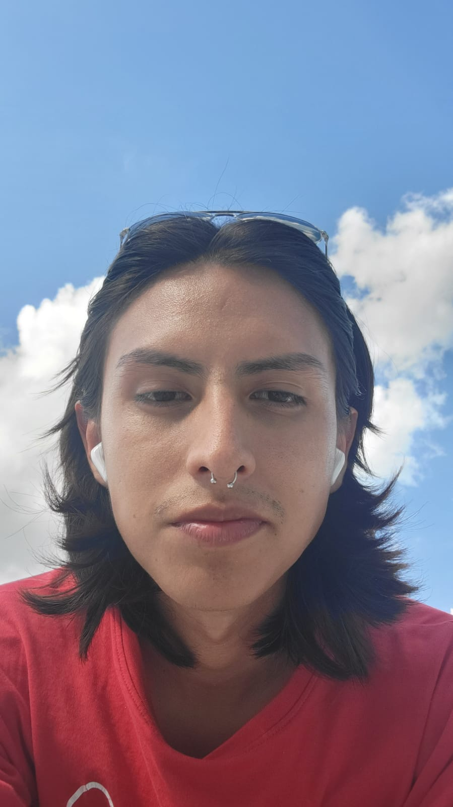

# Proyecto final de Interacción Humano-Computadora

En este repositorio estarán las entregas del proyecto Final de la asignatura Interacción Humano-Computadora

---

## 👥 Integrantes del equipo

-   **Juan Che Martinez**
-   **Emiliano Contreras Gamboa**
-    **Victor Saul Ek May**
-   **Eduardo Manuel del Rio Camacho**
-   **Alejandro Lopez Maldonado**

| Nombre| Foto |
|-----|----------------|
| **Juan Che Martinez** |  |
| **Emiliano Contreras Gamboa** |  |
| **Eduardo Manuel del Rio Camacho** | |
| **Victor Saul Ek May** |  |
| **Alejandro Lopez Maldonado** | | 

---

## 📂 Organización del repositorio

El repositorio está organizado por **entregas**, cada una dentro de su respectivo directorio.

